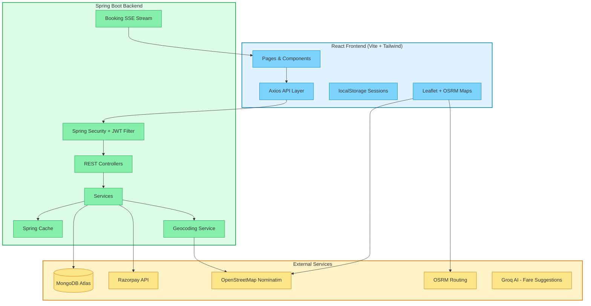
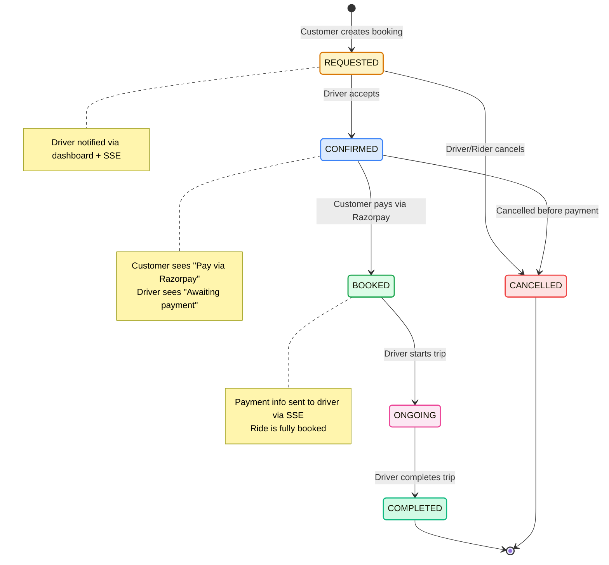
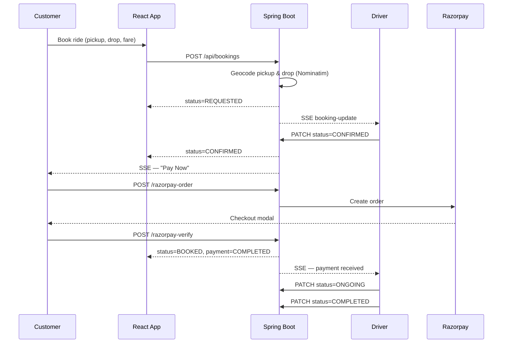
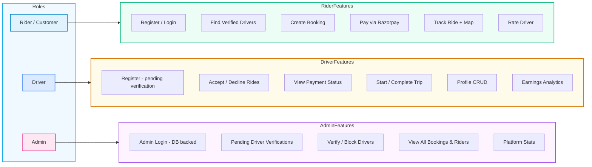
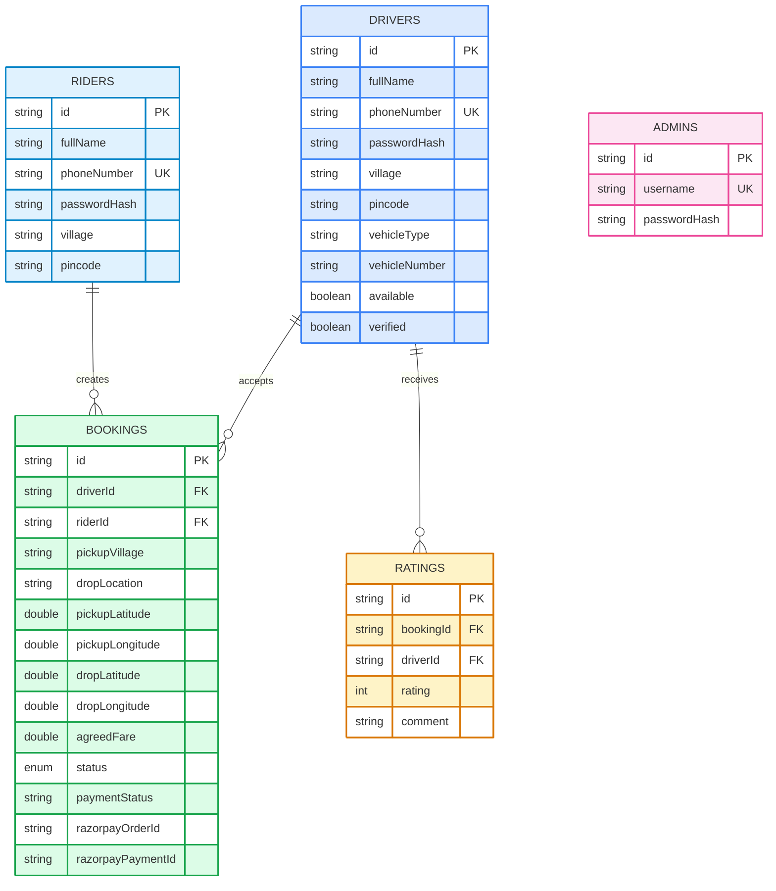
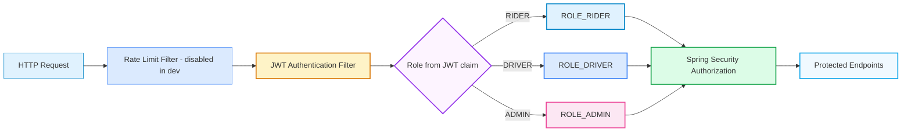
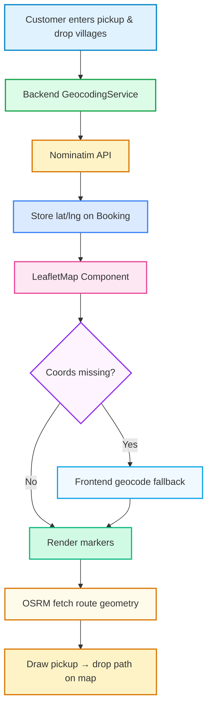

# LocalCab

A rural-first cab booking platform connecting local drivers with customers across villages and small towns in India. LocalCab supports three roles - **Customer (Rider)**, **Driver**, and **Admin** - with JWT authentication, Razorpay payments, live booking tracking, and admin driver verification.

---

## Table of Contents

1. [Architecture Overview](#architecture-overview)
2. [Booking & Payment Flow](#booking--payment-flow)
3. [System Components](#system-components)
4. [Database Design](#database-design)
5. [Security Model](#security-model)
6. [Maps & Geocoding](#maps--geocoding)
7. [Caching Strategy](#caching-strategy)
8. [Project Structure](#project-structure)
9. [Getting Started](#getting-started)

---

## Architecture Overview



---

## Booking & Payment Flow

The ride lifecycle enforces payment **after driver acceptance** and **before the trip starts**.



### Sequence: End-to-End Ride



---

## System Components

### Role Architecture



### Backend Modules

```mermaid
graph TD
    APP[LocalCabApplication]
    style APP fill:#fef3c7,stroke:#d97706,stroke-width:3px

    APP --> AUTH[auth/ - JWT, Admin, Driver login]
    style AUTH fill:#fce7f3,stroke:#ec4899,stroke-width:1px
    APP --> RIDER[rider/ - Customer accounts]
    style RIDER fill:#e0f2fe,stroke:#0284c7,stroke-width:1px
    APP --> DRIVER[driver/ - Driver accounts & availability]
    style DRIVER fill:#dbeafe,stroke:#3b82f6,stroke-width:1px
    APP --> BOOKING[booking/ - Rides, Razorpay, SSE]
    style BOOKING fill:#dcfce7,stroke:#16a34a,stroke-width:1px
    APP --> ADMIN[admin/ - Platform management]
    style ADMIN fill:#fdf4ff,stroke:#9333ea,stroke-width:1px
    APP --> RATING[rating/ - Driver reviews]
    style RATING fill:#fef3c7,stroke:#d97706,stroke-width:1px
    APP --> AI[ai/ - Groq fare suggestions]
    style AI fill:#fce7f3,stroke:#ec4899,stroke-width:1px
    APP --> CONFIG[config/ - Security, Cache, Geocoding, Exceptions]
    style CONFIG fill:#f0f9ff,stroke:#0ea5e9,stroke-width:1px
```



---

## Database Design

MongoDB collections (document store):



### Booking Status Enum

| Status | Meaning |
|--------|---------|
| `REQUESTED` | Customer submitted; awaiting driver |
| `CONFIRMED` | Driver accepted; awaiting Razorpay payment |
| `BOOKED` | Payment received; ride fully booked |
| `ONGOING` | Driver started the trip |
| `COMPLETED` | Trip finished |
| `CANCELLED` | Cancelled by rider or driver |

---

## Security Model



- **JWT** stateless sessions with role claim (`RIDER`, `DRIVER`, `ADMIN`)
- **BCrypt** password hashing for riders, drivers, and admins
- **Admin** seeded in MongoDB from `application.properties` on startup
- **CORS** restricted to localhost dev origins
- **Ownership checks** on profile updates and payments
- **Rate limiting** (10 req/min) available but commented out for development

---

## Maps & Geocoding



- Maps center on the **actual cities/villages** entered by the customer
- Route line drawn via **OSRM** public routing API (falls back to straight line)
- Live driver marker shown during `ONGOING` trips

---

## Caching Strategy

| Cache Name | Data | Evicted On |
|------------|------|------------|
| `availableDrivers` | Verified online drivers by query | Driver verify/block/profile change |
| `driverProfile` | Driver by ID | Profile update |
| `riderProfile` | Rider by ID | — |
| `adminStats` | Platform statistics | Driver verify/block |
| `pendingDrivers` | Unverified driver list | Driver verify/block |

---

## Project Structure

```
LocalCab/
├── client/                    # React + Vite frontend
│   ├── src/
│   │   ├── components/        # Navbar, LeafletMap, Footer
│   │   ├── pages/             # Dashboards, Booking, Auth
│   │   └── utils/             # api.js, auth.js, geocoding.js, bookingHelpers.js
│   └── package.json
├── server/                    # Spring Boot backend
│   └── src/main/java/com/mahesh/LocalCab/
│       ├── auth/              # JWT, login controllers
│       ├── rider/             # Customer module
│       ├── driver/            # Driver module
│       ├── booking/           # Bookings, Razorpay, SSE
│       ├── admin/             # Admin module + AdminUser entity
│       ├── rating/            # Reviews
│       ├── ai/                # Fare suggestions
│       └── config/            # Security, cache, geocoding, exceptions
└── README.md
```

---

## Getting Started

### Prerequisites

- Java 17+
- Node.js 18+
- MongoDB Atlas (or local MongoDB)
- Razorpay test keys
- Groq API key (optional, for AI fare suggestions)

### Backend

```bash
cd server
# Configure src/main/resources/application.properties (see below)
mvn spring-boot:run
```

Server runs at `http://localhost:8080`

### Frontend

```bash
cd client
npm install
npm run dev
```

App runs at `http://localhost:5173`

### Test Accounts

| Role | How to access |
|------|---------------|
| Customer | Register at `/register` → Login at `/login` |
| Driver | Register at `/register` (Driver tab) → Admin must verify |
| Admin | `/admin/login` — credentials from `application.properties` |

---

## Analytics (Dashboards)

### Customer Dashboard
- Total bookings, active rides, paid rides, total spent
- Live map with pickup/drop route for active booking
- Razorpay payment when status = `CONFIRMED`

### Driver Dashboard
- Rating summary, Razorpay earnings, active/pending counts
- Accept → wait for payment → start → complete workflow
- Profile CRUD (name, village, vehicle details)

### Admin Dashboard
- Pending verifications inbox
- Verify drivers before they appear to customers
- Platform stats: drivers, bookings, pending count

---

## Tech Stack

| Layer | Technology |
|-------|------------|
| Frontend | React 19, Vite, Tailwind CSS, React Router 6, Axios, Leaflet |
| Backend | Java 17, Spring Boot 3.3, Spring Security, Spring Data MongoDB |
| Auth | JWT (jjwt), BCrypt |
| Payments | Razorpay Java SDK |
| Maps | OpenStreetMap, Nominatim, OSRM |
| AI | Spring AI + Groq (Llama 3) |
| Database | MongoDB Atlas |
| Real-time | Server-Sent Events (SSE) |

---

Built for rural India — transparent fares, verified local drivers, and community-first mobility.
